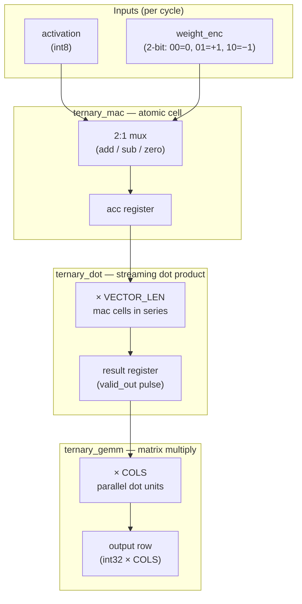

# TernaryCore

**An open-source FPGA accelerator for BitNet ternary neural network inference.**

BitNet b1.58 encodes every model weight as {-1, 0, +1}. That collapses matrix multiplication — the core operation of every transformer layer — into additions, subtractions, and conditional skips. No multiplies. TernaryCore is hardware built to match that arithmetic natively.

[](https://ohwr.org/cern_ohl_s_v2.txt)
[]()

---

## Simulation Status

| Module | Tests | Status |
|--------|-------|--------|
| `ternary_mac` | 8/8 | ✅ All passing |
| `ternary_dot` | 7/7 | ✅ All passing |
| `ternary_gemm` | 16/16 (4×4) | ✅ All passing |
| `activation_quant` | formal (cover + prove) | ✅ All passing |
| `ternary_scale` | formal (cover + prove) | ✅ All passing |
| `ternary_pipeline` | formal + C++ sim | ✅ All passing |

> **All tests passing!** The system has been fully verified with RTL simulation matching Python reference implementation. Recent fixes addressed timing bugs in `ternary_dot.v` and testbench race conditions.

### Recent Fixes

1. **Fixed `ternary_dot.v` timing bugs**:
   - `valid_out` now pulses for exactly one cycle when the dot product is ready
   - `vector_done` self-clears on `valid_in=0` (no longer sticky-high across vectors)
   - Removed dead `result_latch`/`vector_done_delayed` registers
   - Supports back-to-back vectors: a new vector can start the cycle after the previous result latches
   - Removed debug statements for cleaner output

2. **Fixed testbench race conditions**:
   - Added `#1` delays before clock edges
   - Added extra cycle after reset for signal stabilization

3. **Added platform-agnostic documentation**
   - Support for macOS, Linux, Windows (WSL)
   - Multiple waveform viewer options
   - Simplified verification without numpy dependency

---

## Waveforms

`ternary_mac` — 8 test vectors, all passing:


`acc_out` updates exactly one clock after each `valid_in` pulse. Sign extension and two's-complement negation handled with no DSP blocks — adders and mux logic only.

`ternary_dot` — streaming dot product, 7/7 tests passing (VLEN=8 shown):


Eight activations stream in one per clock with weight=+1. `acc_out` holds zero while the MAC cell accumulates internally, then the final result (36) appears in the same cycle `valid_out` pulses.

`ternary_gemm` — 4×4 matrix multiply, 16/16 tests passing:


Four parallel `ternary_dot` instances (col_0–col_3) receive the same activation broadcast per clock, each with its own weight encoding. One result row lands simultaneously across all four columns when `valid_out` pulses.

---

## Architecture



Three layers, each building on the last:

**`ternary_mac`** — the atomic cell. Takes one activation, one 2-bit weight, and a running accumulator. Outputs `acc_in ± activation` or `acc_in` (zero weight), registered on the clock edge. No multiplier.

**`ternary_dot`** — streaming dot product over `VECTOR_LEN` elements (default 64). Resets automatically between vectors; asserts `valid_out` for one cycle when the result is ready.

**`ternary_gemm`** — matrix multiply using `COLS` parallel `ternary_dot` instances. One activation is broadcast per cycle to all column dots, each receiving its own weight encoding. Produces one output row every `DEPTH` cycles.

### Weight Encoding

| `weight_enc` | Ternary value | Operation |
|---|---|---|
| `2'b00` | 0 | No contribution (skip) |
| `2'b01` | +1 | `acc_out = acc_in + activation` |
| `2'b10` | -1 | `acc_out = acc_in - activation` |

---

## BitNet Inference Pipeline

The GEMM core computes ternary matmuls, but a real BitNet b1.58 layer also needs
input quantization to INT8, an integer scaling multiply, and FP8→Q15 conversion
for streaming activations. These modules complete the layer:

**`activation_quant`** — quantizes an INT8 activation `x` to INT8 with
`q = RoundClip(x * inv / 2^PRECISION, -Q_MAX, +Q_MAX)` (Q_MAX = 127 for INT8,
`inv` precomputed in software). Round-to-nearest via `+ 2^(PRECISION-1)`;
no zero-point offset is used. Two pipeline stages.

**`ternary_scale`** — post-GEMM scaling: multiplies the integer accumulator
(`acc`) by `alpha` (Q15) and rounds back to the output data width. Two pipeline stages.

**`fp8_to_q15`** — converts an FP8 (E5M2) activation to Q15, for feeding the
GEMM array from an FP8 stream. Single-cycle, combinatorial.

**`ternary_pipeline`** — ties it together: `activation_quant` → `ternary_gemm` →
`ternary_scale` using simple valid/valid_out handshaking. No FIFOs and no AXI
interfaces; the pipeline is a purely streaming datapath.

> **DSP usage — honest accounting.** The GEMM core (`ternary_mac`/`ternary_dot`/
> `ternary_gemm`) is multiplier-free. The inference pipeline is not: both
> `activation_quant` and `ternary_scale` contain a real integer multiplier
> (`activation * inv`, `acc * alpha`). On FPGAs these map to DSP slices. A
> full-layer implementation therefore uses DSPs for quantization/scaling, not
> for the matmul itself.

Run the fast C++ simulation of the whole pipeline (576-element vectors):

```bash
cd sim
make verilator-all          # MAC, dot, GEMM, and full-pipeline C++ sims
```

---

## Getting Started

### Prerequisites

**All platforms:**
- Python 3 (for verification scripts)

**Verilog Simulator (choose one):**
- **Icarus Verilog** (recommended, open source)
  - **macOS**: `brew install icarus-verilog`
  - **Ubuntu/Debian**: `sudo apt-get install iverilog`
  - **Fedora/RHEL**: `sudo dnf install iverilog`
  - **Windows** (WSL2): Use Ubuntu/Debian commands above
  - **Windows** (native): Install from [Icarus Verilog Windows builds](http://bleyer.org/icarus/)

- **Verilator** (alternative, faster simulation)
  - **macOS**: `brew install verilator`
  - **Ubuntu/Debian**: `sudo apt-get install verilator`
  - See [verilator.org](https://verilator.org) for other platforms

### Setup

```bash
git clone https://github.com/shepherdscientific/ternarycore.git
cd ternarycore/sim
```

### Run simulations

```bash
make tb_ternary_mac    # ternary_mac — 8 tests
make tb_ternary_dot    # ternary_dot — 7 tests (VLEN=8)
make tb_ternary_gemm   # ternary_gemm — 4×4 matrix multiply
make all               # run all three
```

### Cross-verify with Python

```bash
make verify
# or individually:
python3 verify/verify_mac.py
python3 verify/verify_dot.py
python3 verify/verify_gemm_simple.py  # No numpy dependency
```

### View waveforms

**For debugging waveforms (.vcd files):**
- **GTKWave** (cross-platform, open source)
  - **macOS**: `brew install gtkwave`
  - **Ubuntu/Debian**: `sudo apt-get install gtkwave`
  - **Windows**: Available via [MSYS2](https://www.msys2.org/) or WSL

- **Alternative options:**
  - **WaveTrace** (macOS app, free) - Recommended for macOS users
  - **Verilog HDL VSCode Extension** (VSCode plugin with waveform viewer)
  - **Scansion** (macOS, paid)
  - **ModelSim/QuestaSim** (commercial, university licenses available)

**Note for macOS users:** GTKWave may have issues on newer macOS versions. Consider WaveTrace or Verilog HDL VSCode Extension as alternatives.

---

## Repository Layout

```
ternarycore/
├── rtl/
│   ├── ternary_mac.v       # single MAC cell
│   ├── ternary_dot.v       # streaming dot product
│   └── ternary_gemm.v      # matrix multiply
├── tb/
│   ├── tb_ternary_mac.v
│   ├── tb_ternary_dot.v
│   └── tb_ternary_gemm.v
├── sim/
│   ├── Makefile
│   └── verify/
│       ├── verify_mac.py
│       ├── verify_dot.py
│       └── verify_gemm.py
├── docs/
│   ├── ROADMAP.md          # Track A/B system design (soft CPU + ternary accelerator)
│   └── waveform_mac.svg
├── DEVKIT.md               # build → flash → benchmark guide (Track A)
└── LICENSE                 # CERN-OHL-S v2 (RTL) + MIT (scripts)
```

---

## The Question This Project Answers

Ternary compute is proven on silicon: a `ternary_mac` cell runs on the Arty
A7-100T (and Tang Nano 9k) using **0 DSP slices** — LUTs and flip-flops only
(see the [bring-up write-up](docs/article-02.md)). The next question is the
one that matters:

> **Put a soft CPU on the same fabric next to TernaryCore, and run BitNet
> models both ways — pure CPU vs CPU + ternary offload — on identical
> weights.** Same board, same clock, same model: the with/without-ternary A/B
> is the proof that native ternary hardware earns its place.

The system design for this is captured in [`docs/ROADMAP.md`](docs/ROADMAP.md)
(Track A: MicroBlaze + AXI + ternary GEMM array on the Arty A7; Track B:
PicoRV32 + ternary PQC accelerator on the Tang Nano), and the reproducible
build/flash/benchmark path is in [`DEVKIT.md`](DEVKIT.md). The Tier 1
benchmark firmware runs the same 768→768 projection through the accelerator
and through pure C on the soft CPU, verifies element-by-element agreement,
then reports cycles and speedup over UART.

## Roadmap

- [x] `ternary_mac` — single cell, all tests passing
- [x] `ternary_dot` — 64-element vector dot product, all tests passing
- [x] `ternary_gemm` — 4×4 matrix multiply, all tests passing
- [x] Deploy to Xilinx Artix-7 (Arty A7-100T) — single MAC verified on silicon via ILA, 0 DSPs ([write-up](docs/article-02.md))
- [x] Timing closure and resource utilisation report (single MAC: ~81 LUTs / 32 FFs)
- [x] Track A system design: soft CPU (MicroBlaze) + AXI + GEMM array + weight BRAM + Tier 1 A/B benchmark firmware — passing simulation on [`feat/bitnet-accelerator`](https://github.com/Ternarycore/ternarycore/tree/feat/bitnet-accelerator)
- [x] **Tier 1 on hardware** — `Verification PASS` on the Arty A7 (July 25, 2026): 768→768 ternary projection, accelerator 5.32M cycles/pass vs soft-CPU 19.5M cycles/pass on the same silicon — **3.67× speedup** with the GEMM array at ~3% utilization (CPU-fed AXI is the bottleneck, as designed for Tier 1; see the [bring-up article](https://github.com/Ternarycore/ternarycore/blob/feat/bitnet-accelerator/docs/article-03.md))
- [ ] Host→board weight streaming (`LOADW`/`LOADA`/`RUN` UART protocol) — run *real* BitNet checkpoints, not synthetic weights
- [ ] Scale GEMM columns toward the 40 GOPS target (Tier 2)
- [ ] Head-to-head benchmark: tokens/sec and W vs CPU/GPU baseline
- [ ] Full transformer layer pipeline

---

## License

RTL source files (`rtl/`, `tb/`) are licensed under the **CERN Open Hardware Licence v2 — Strongly Reciprocal (CERN-OHL-S v2)**. Derivative hardware designs must remain open under the same terms.

Software tools and verification scripts (`sim/verify/*.py`) are licensed under the **MIT License**.

See [LICENSE](LICENSE) for full terms.

---

## Related Work

- Benchmark repo (KV cache / local LLM inference): [github.com/shepherdscientific/llama-server-tuning](https://github.com/shepherdscientific/llama-server-tuning)
- BitNet b1.58: [arxiv.org/abs/2402.17764](https://arxiv.org/abs/2402.17764)
- CERN-OHL-S v2: [ohwr.org/cern_ohl_s_v2.txt](https://ohwr.org/cern_ohl_s_v2.txt)
