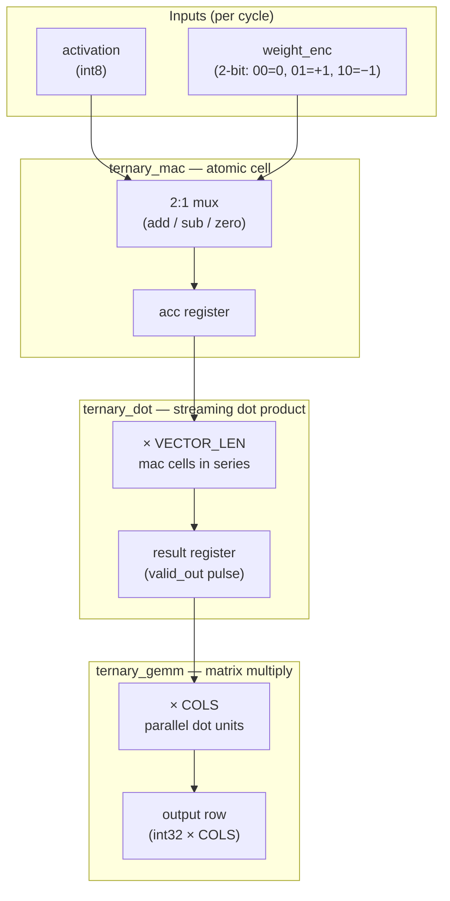

# TernaryCore

**An open-source FPGA accelerator for BitNet ternary neural network inference.**

BitNet b1.58 encodes every model weight as {-1, 0, +1}. That collapses matrix multiplication — the core operation of every transformer layer — into additions, subtractions, and conditional skips. No multiplies. TernaryCore is hardware built to match that arithmetic natively.

[](https://ohwr.org/cern_ohl_s_v2.txt)
[]()

---

## Simulation Status

| Module | Tests | Status |
|--------|-------|--------|
| `ternary_mac` | 8/8 | ✅ All passing |
| `ternary_dot` | 7/7 | ✅ All passing |
| `ternary_gemm` | 16/16 (4×4) | ✅ All passing |

> **All tests passing!** The system has been fully verified with RTL simulation matching Python reference implementation. Recent fixes addressed timing bugs in `ternary_dot.v` and testbench race conditions.

### Recent Fixes (April 2026)

1. **Fixed `ternary_dot.v` timing bugs**: 
   - `valid_out` now pulses correctly one cycle after last element
   - Fixed `vector_done` logic to persist through `valid_in=0`
   - Removed debug statements for cleaner output

2. **Fixed testbench race conditions**:
   - Added `#1` delays before clock edges
   - Added extra cycle after reset for signal stabilization

3. **Added platform-agnostic documentation**
   - Support for macOS, Linux, Windows (WSL)
   - Multiple waveform viewer options
   - Simplified verification without numpy dependency

---

## Waveforms

`ternary_mac` — 8 test vectors, all passing:


`acc_out` updates exactly one clock after each `valid_in` pulse. Sign extension and two's-complement negation handled with no DSP blocks — adders and mux logic only.

`ternary_dot` — streaming dot product, 7/7 tests passing (VLEN=8 shown):


Eight activations stream in one per clock with weight=+1. `acc_out` holds zero while the MAC cell accumulates internally, then the final result (36) appears in the same cycle `valid_out` pulses.

`ternary_gemm` — 4×4 matrix multiply, 16/16 tests passing:


Four parallel `ternary_dot` instances (col_0–col_3) receive the same activation broadcast per clock, each with its own weight encoding. One result row lands simultaneously across all four columns when `valid_out` pulses.

---

## Architecture



Three layers, each building on the last:

**`ternary_mac`** — the atomic cell. Takes one activation, one 2-bit weight, and a running accumulator. Outputs `acc_in ± activation` or `acc_in` (zero weight), registered on the clock edge. No multiplier.

**`ternary_dot`** — streaming dot product over `VECTOR_LEN` elements (default 64). Resets automatically between vectors; asserts `valid_out` for one cycle when the result is ready.

**`ternary_gemm`** — matrix multiply using `COLS` parallel `ternary_dot` instances. One activation is broadcast per cycle to all column dots, each receiving its own weight encoding. Produces one output row every `DEPTH` cycles.

### Weight Encoding

| `weight_enc` | Ternary value | Operation |
|---|---|---|
| `2'b00` | 0 | No contribution (skip) |
| `2'b01` | +1 | `acc_out = acc_in + activation` |
| `2'b10` | -1 | `acc_out = acc_in - activation` |

---

## Getting Started

### Prerequisites

**All platforms:**
- Python 3 (for verification scripts)

**Verilog Simulator (choose one):**
- **Icarus Verilog** (recommended, open source)
  - **macOS**: `brew install icarus-verilog`
  - **Ubuntu/Debian**: `sudo apt-get install iverilog`
  - **Fedora/RHEL**: `sudo dnf install iverilog`
  - **Windows** (WSL2): Use Ubuntu/Debian commands above
  - **Windows** (native): Install from [Icarus Verilog Windows builds](http://bleyer.org/icarus/)

- **Verilator** (alternative, faster simulation)
  - **macOS**: `brew install verilator`
  - **Ubuntu/Debian**: `sudo apt-get install verilator`
  - See [verilator.org](https://verilator.org) for other platforms

### Setup

```bash
git clone https://github.com/shepherdscientific/ternarycore.git
cd ternarycore/sim
```

### Run simulations

```bash
make tb_ternary_mac    # ternary_mac — 8 tests
make tb_ternary_dot    # ternary_dot — 7 tests (VLEN=8)
make tb_ternary_gemm   # ternary_gemm — 4×4 matrix multiply
make all               # run all three
```

### Cross-verify with Python

```bash
make verify
# or individually:
python3 verify/verify_mac.py
python3 verify/verify_dot.py
python3 verify/verify_gemm_simple.py  # No numpy dependency
```

### View waveforms

**For debugging waveforms (.vcd files):**

The Makefile auto-detects the best available viewer:

```bash
make view-mac    # open MAC simulation waveform
make view-dot    # open dot product waveform
make view-gemm   # open GEMM waveform
```

Supported viewers (detected in priority order):

| Viewer | Install | Notes |
|--------|---------|-------|
| **[Surfer](https://surfer-project.org)** | `cargo install surfer` | Modern, fast, cross-platform. TUI + GUI. |
| **WaveTrace** | `brew install --cask wavetrace` | macOS native app, free |
| **GTKWave** | `brew install gtkwave` | Legacy, cross-platform, widely available |

---

## Repository Layout

```
ternarycore/
├── rtl/
│   ├── ternary_mac.v       # single MAC cell
│   ├── ternary_dot.v       # streaming dot product
│   └── ternary_gemm.v      # matrix multiply
├── tb/
│   ├── tb_ternary_mac.v
│   ├── tb_ternary_dot.v
│   └── tb_ternary_gemm.v
├── sim/
│   ├── Makefile
│   └── verify/
│       ├── verify_mac.py
│       ├── verify_dot.py
│       └── verify_gemm.py
├── docs/
│   └── waveform_mac.svg
└── LICENSE                 # CERN-OHL-S v2 (RTL) + MIT (scripts)
```

---

## Roadmap

- [x] `ternary_mac` — single cell, all tests passing
- [x] `ternary_dot` — 64-element vector dot product, all tests passing
- [x] `ternary_gemm` — 4×4 matrix multiply, all tests passing
- [ ] Deploy to Xilinx Artix-7 (Arty A7-100T) — **board ordered**
- [ ] `ternary_dot` at 64-element depth on real silicon
- [ ] Timing closure and resource utilisation report
- [ ] Head-to-head benchmark: tokens/sec and W vs CPU/GPU baseline
- [ ] Full transformer layer pipeline

---

## License

RTL source files (`rtl/`, `tb/`) are licensed under the **CERN Open Hardware Licence v2 — Strongly Reciprocal (CERN-OHL-S v2)**. Derivative hardware designs must remain open under the same terms.

Software tools and verification scripts (`sim/verify/*.py`) are licensed under the **MIT License**.

See [LICENSE](LICENSE) for full terms.

---

## Acknowledgements

**Concept:** David Adebiyi and Abu Mohammed — the conversations that sharpened the idea.

**The spark:** A [comment by @Xcc313r4n7](https://github.com/ggml-org/llama.cpp/discussions/20969#discussioncomment-16349981) on the llama.cpp thread arguing that biological neurons are themselves ternary — selected by evolution for exactly the same reason we're building this. Contested by the community, but it lodged.

**Family & background:** Mr Niyi Olowoyo, Mr Fisayo Bejide, My Uncle Tayo Oladapo, my mother, my wife, and my daughters — each of whom contributed something, knowingly or not, to making this possible.

*Full credits in the [launch article](https://www.linkedin.com/in/ifedayooladapo).*

---

## Related Work

- Benchmark repo (KV cache / local LLM inference): [github.com/shepherdscientific/llama-server-tuning](https://github.com/shepherdscientific/llama-server-tuning)
- BitNet b1.58: [arxiv.org/abs/2402.17764](https://arxiv.org/abs/2402.17764)
- CERN-OHL-S v2: [ohwr.org/cern_ohl_s_v2.txt](https://ohwr.org/cern_ohl_s_v2.txt)
